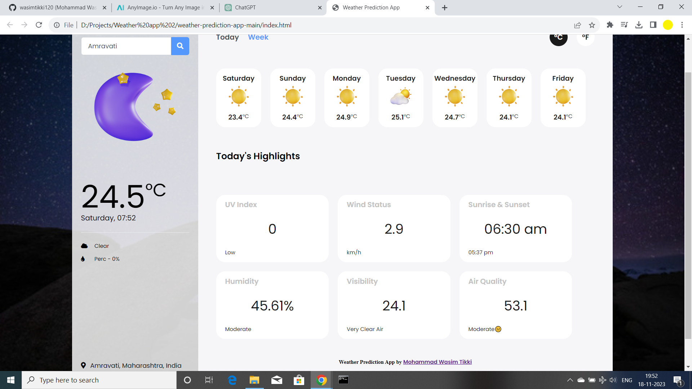
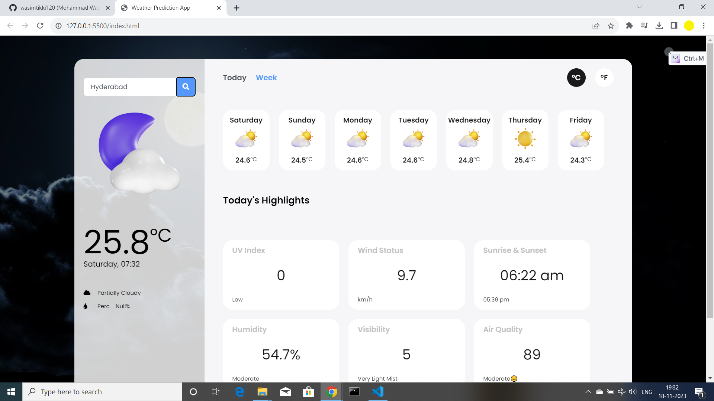

# WeatherVista - Interactive Weather App

## Overview

Welcome to WeatherVista, a cutting-edge and user-friendly weather prediction app. WeatherVista not only provides accurate weather forecasts but also offers an engaging and intuitive user experience.

### Features:

- **Responsive Design:** Enjoy a seamless experience across various devices with WeatherVista's responsive UI.
- **Dynamic Weather Icons:** Visualize real-time weather conditions with dynamic icons for a more immersive experience.
- **Hourly and Weekly Forecasts:** Plan your schedule confidently with detailed hourly and weekly forecasts.
- **Today's Highlights:** Stay informed about key weather highlights, including UV Index, Wind Status, Sunrise & Sunset, Humidity, Visibility, and Air Quality.
- **Search Functionality:** Easily search for weather updates in any location globally.

## Screenshots

## Getting Started

1. Clone the repository: `git clone https://github.com/your-username/WeatherVista.git`
2. Open `index.html` in your preferred browser to launch the app.

## Usage

- Enter a location in the search bar to get the current weather details for that area.
- Switch between hourly and weekly forecasts for detailed weather information.
- Explore the highlight cards to learn more about today's weather insights.

## License

WeatherVista is licensed under the [MIT License](LICENSE). Feel free to customize and use it in your projects.

## Author

[Mohammad Wasim Tikki](https://github.com/wasimtikki120)

## Contribution

Contributions are welcome! Please check our [Contribution Guidelines](CONTRIBUTING.md).

## Support

If you encounter any issues or have suggestions, [open an issue](https://github.com/your-username/WeatherVista/issues).

## About

WeatherVista is the result of a passion for creating user-friendly applications that empower individuals to make informed decisions. Inspired by a love for technology and the desire to simplify weather information, Mohammad Wasim Tikki set out to develop a weather app that seamlessly integrates accuracy with an engaging user experience. Join us in exploring the world of WeatherVista!
